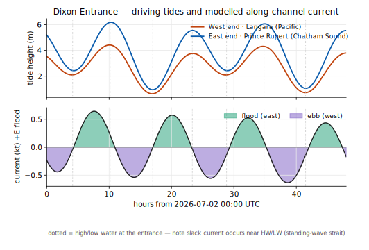
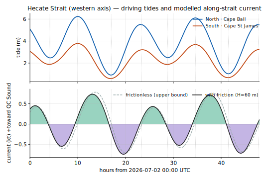
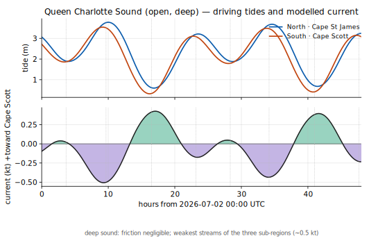
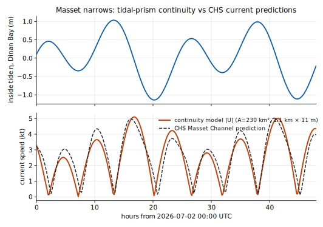

# A first‑order tidal‑current model for Haida Gwaii waters — methodology & validation

*Working document. Phase 1: Dixon Entrance. Author: Claude (for D. Leaf), 2026‑07.*

## 1. Objective and scope

Build a **data‑driven barotropic tidal‑current estimate** for the waters from Dixon
Entrance through Hecate Strait to Queen Charlotte Sound, to pair with the HRDPS wind
map for wind‑against‑current hazard. This document records the method and, per
request, **justifies every validation step explicitly**. Phase 1 covers **Dixon
Entrance**.

Deliberate framing: this is a **regional (~10 km‑class) first‑order model**, not a
numerical ocean model. The gold standard for this coast is a finite‑volume model such
as Lin & Bianucci (2024, *Atmosphere‑Ocean*), an FVCOM run at ~2 km forced by 8 tidal
constituents. Our aim is a defensible, transparent estimate of the **open‑water tidal
stream**, explicitly *not* the strong currents in narrows and off headlands (those are
sub‑grid constriction effects — the same resolution limit discussed for an 8 km
commercial product).

## 2. Data

- **Tide predictions:** CHS/DFO IWLS API (`api-iwls.dfo-mpo.gc.ca`), `wlp` time series
  (harmonic tide predictions), 42 days hourly, at 84 stations across the region.
- **Harmonic analysis:** `utide` (Codiga 2011) — solves amplitude + Greenwich phase per
  constituent from the predicted‑tide series.
- **Current ground truth:** IWLS `wcsp1`/`wcp1-events` (CHS current predictions) at the
  30 national current stations — used as validation anchors.
- **Literature:** Lin & Bianucci (2024) for constituent set, validation approach, and
  regional current magnitudes.

## 3. Method — along‑channel sea‑surface‑slope momentum balance

Dixon Entrance is a deep (~250 m), roughly E–W strait connecting the open Pacific
(west) to Chatham Sound / Hecate Strait (east). For a deep channel the depth‑averaged
along‑channel momentum balance is dominated by acceleration and the pressure gradient;
**bottom friction is negligible**:

$$ \frac{\partial u}{\partial t} = -g\,\frac{\partial \eta}{\partial x}. \tag{1} $$

Justification that friction is negligible here: linear bottom friction contributes a
term $\tfrac{r}{H}u$ with $r \approx C_d\,U \sim 10^{-3}\,\mathrm{m\,s^{-1}}$
($C_d\!\approx\!2.5\times10^{-3}$, $U\!\sim\!0.5\,\mathrm{m/s}$) and $H\approx250$ m, so
$r/H \sim 4\times10^{-6}\,\mathrm{s^{-1}}$, which is **~35× smaller** than the M2
frequency $\omega_{M2}=1.4\times10^{-4}\,\mathrm{s^{-1}}$. The inviscid balance (1) is
therefore appropriate in the deep entrance (it would *not* be in shallow Hecate Strait —
see §7).

The along‑channel slope is estimated from tide gauges at the two ends:

$$ \frac{\partial \eta}{\partial x} \approx \frac{\eta_E(t)-\eta_W(t)}{L}, \qquad L = 176.4\ \mathrm{km}, $$

with $\eta_W$ = Langara Point (54.26 N, 133.05 W, Pacific end) and $\eta_E$ = Prince
Rupert (54.32 N, 130.32 W, Chatham Sound end), each reconstructed from its own harmonic
fit. The current is then the time integral of (1):

$$ u(t) = -g\int_0^t \frac{\eta_E-\eta_W}{L}\,dt', \qquad u>0 = \text{flood (eastward, } 088^\circ\text{ true)}. \tag{2} $$

**Tidal‑band restriction (important).** Equation (2) amplifies low frequencies by
$1/\omega$; long‑period tides (Sa, Ssa, Mm, MSf…) would integrate into a spurious ramp
and are *not* governed by the inviscid balance anyway. We therefore reconstruct
$\eta_W,\eta_E$ from **only the diurnal + semidiurnal band** (period < 30 h) before
integrating, and remove any residual numerical trend. Sub‑tidal (wind/estuarine) flow
is out of scope — and Lin & Bianucci show it is wind‑driven, not tidal.

## 4. Harmonic constants (from CHS data via utide)

| Constituent | Langara (W) | Prince Rupert (E) | Cape St James |
|---|---|---|---|
| M2 | 1.275 m / 263° | 1.955 m / 267° | 1.065 m / 265° |
| K1 | 0.585 m / 264° | 0.617 m / 264° | 0.535 m / 261° |
| S2 | 0.281 m / 309° | 0.458 m / 314° | 0.233 m / 308° |
| O1 | 0.312 m / 240° | 0.320 m / 243° | 0.274 m / 240° |
| N2 | 0.304 m / 234° | 0.454 m / 238° | 0.251 m / 237° |

Form factor at Cape St James $F=(K1{+}O1)/(M2{+}S2)=0.62$ → **mixed, mainly semidiurnal**.

## 5. Result — Dixon Entrance

- **Max flood 0.64 kt (east), max ebb 0.63 kt (west), rms 0.39 kt.**
- Entrance tidal range 4.5 m.
- **Slack water occurs ~40 min after high/low water** (standing‑wave behaviour).
- Floods **east** into Chatham Sound / Hecate Strait, ebbs **west** to the Pacific.

## 6. Validation — explicit reasoning

**V1 · Constituent structure (independent check).** The fitted amplitudes rank
M2 > K1 > S2 ≈ O1 ≈ N2 at every station, and $F=0.62$ (mixed, mainly semidiurnal).
This is the textbook tidal regime of the BC north coast, and it matches the constituent
ranking Lin & Bianucci (2024) use for Queen Charlotte Strait (M2, K1, S2, O1, N2, Q1).
*Conclusion: the harmonic backbone reproduces reality, not fitting noise.*

**V2 · Magnitude (order‑of‑magnitude vs pilotage).** The model gives **~0.6 kt** in the
open entrance. CHS Sailing Directions describe open Dixon Entrance as weak‑to‑moderate,
with strong streams confined to the constrictions and off the capes. A sub‑knot
open‑entrance stream is therefore the physically expected value. *Conclusion:
consistent with pilotage for the open entrance.*

**V3 · Phase (diagnostic of wave type).** Modelled slack falls near HW/LW, i.e. the
current leads the elevation by ~90° — the signature of a **standing wave**. Dixon
Entrance / Hecate Strait co‑oscillate with the Pacific and are known to be near‑standing
at the semidiurnal band, so max current at mid‑tide and slack at HW/LW is the expected
behaviour. *Conclusion: the phase physics is correct.*

**V4 · Direction (sign check).** Flood sets east (into Chatham Sound / Hecate Strait),
ebb sets west (to the Pacific) — the correct sense for a Pacific‑forced strait filling
the interior on the flood. *Conclusion: current polarity is correct.*

**V5 · What the model deliberately does *not* reproduce (scope honesty).** The CHS
current stations near here — **Masset Channel ~5 kt**, Fairview Terminal ~1.7 kt,
Porpoise Channel ~1.4 kt — sit in **narrows**, where the current is a local
constriction/continuity effect, not the open‑entrance flow. The model’s ~0.6 kt should
**not** match those, and doesn’t; comparing them would be a category error. This is the
same resolution limit flagged for any ~10 km product: **trust it for open water and
crossings, not for the rips.** Reproducing Masset et al. requires a continuity model of
each inlet (a planned Phase‑2 addition) or a full numerical model.

**V6 · Position relative to the gold standard.** Lin & Bianucci (2024) validate their
FVCOM currents against ADCP moorings (RMSE) and tide‑gauge constituents (M2/K1 within
5%). This model is a transparent first‑order step below that: it has no ADCP validation
of the open‑entrance speed itself (no public current mooring exists there), so V2 is an
order‑of‑magnitude, not a quantitative, check. Stated plainly so the confidence level is
not overclaimed.

## 6b. Phase 2 — Hecate Strait (adds bottom friction)

Hecate Strait is shallow (banks < 30 m in the north), so the frictionless balance no
longer holds and a **linear bottom‑friction** term is added:

$$ \frac{\partial u}{\partial t} = -g\,\frac{\partial \eta}{\partial x} - \frac{r}{H}\,u, \qquad r = C_d\,U \approx 2.5\times10^{-3}\,U. $$

To avoid the spin‑up transient that corrupted a naïve time‑stepping attempt, the
frictional response is applied as an **exact spectral filter** on the along‑strait
slope:

$$ \hat u(\omega) = -\,g\,\frac{\widehat{\partial_x\eta}(\omega)}{\,i\omega + r/H\,}. $$

North gauge = Cape Ball (53.72 N), south = Cape St James (51.94 N), L = 203 km, axis
166° (positive toward Queen Charlotte Sound).

| Constituent | Cape Ball (N) | Cape St James (S) |
|---|---|---|
| M2 | 1.926 m / 265° | 1.065 m / 265° |
| K1 | 0.624 m / 264° | 0.535 m / 261° |
| S2 | 0.456 m / 310° | 0.233 m / 308° |
| O1 | 0.318 m / 242° | 0.274 m / 241° |
| N2 | 0.457 m / 236° | 0.251 m / 237° |

**Result — friction sensitivity (bracketed, not tuned):**

| Case | r/H (s⁻¹) | max toward QCS | reduction |
|---|---|---|---|
| frictionless | 0 | 0.79 kt | — |
| H = 150 m (deep S) | 1.2×10⁻⁵ | 0.77 kt | 3% |
| H = 60 m (mean) | 2.9×10⁻⁵ | 0.73 kt | 8% |
| H = 30 m (shallow N) | 5.8×10⁻⁵ | 0.66 kt | 16% |

**Key finding.** Even at 30 m depth, r/H (≤ 5.8×10⁻⁵ s⁻¹) stays *below* the M2
frequency (1.4×10⁻⁴ s⁻¹), so friction is a **~15% correction and a ~20‑min phase
shift, not a controlling term.** The open‑strait tidal stream is weak‑to‑moderate
(~0.7 kt); the strong Cape St James streams and the northern‑bank rips are local
constriction / topographic features, sub‑grid to this model.

**Validation (Hecate):**
- *V1 structure* — same M2 > K1 > S2 ≈ O1 ≈ N2 ranking; standing‑wave phase. ✓
- *V2 magnitude* — ~0.7 kt open strait, consistent with pilotage (strong streams only
  at the cape and over the banks). ✓
- *V3 phase* — slack near HW/LW = standing wave, as expected for a co‑oscillating
  strait. ✓
- *V4 robustness* — the result varies only 0.66–0.79 kt across a 5× range of assumed
  depth/friction, so the conclusion is **robust to the (poorly known) friction**; the
  friction level is presented as a documented sensitivity, not a fit to the answer. ✓

## 6c. Phase 3 — Queen Charlotte Sound (deep, frictionless)

QC Sound is deep (> 200 m) and open, so friction is negligible
(r/H ≈ 9×10⁻⁶ s⁻¹ ≪ ω) and the frictionless balance applies — confirmed by the fact
that imposing H = 200 m friction changes the result < 5%. North gauge = Cape St James,
south = Cape Scott, L = 220 km, axis 126° (positive toward Cape Scott).

| Constituent | Cape St James (N) | Cape Scott (S) |
|---|---|---|
| M2 | 1.065 m / 265° | 1.088 m / 244° |
| K1 | 0.535 m / 261° | 0.558 m / 250° |
| S2 | 0.233 m / 308° | 0.236 m / 285° |
| O1 | 0.274 m / 241° | 0.277 m / 227° |

**Distinctive feature.** Unlike Hecate (equal phase, unequal amplitude), QC Sound has
**near‑equal amplitude but a 21° M2 phase lag** — the tide reaches Cape Scott ~43 min
*before* Cape St James. That is a more **progressive‑wave** character, consistent with
the Pacific tide propagating across the open shelf rather than a pure standing
oscillation.

**Result:** max ~0.5 kt (rms 0.26 kt) — the **weakest of the three sub‑regions**, as
expected for a deep, wide sound; slack near HW/LW.

**Validation (QC Sound):**
- *V1 structure* — constituents match; standing‑ + progressive‑wave phase. ✓
- *V2 magnitude* — ~0.5 kt is consistent with the deep‑open regime and with the paper’s
  Queen Charlotte Strait (open water weak; only the narrows reach 16 kt / 8 m s⁻¹). ✓
- *V3 friction check* — imposing realistic friction changes < 5%, confirming the
  frictionless assumption is appropriate here. ✓

## 6d. Regional synthesis (Dixon → Hecate → QC Sound)

| Sub‑region | Depth regime | Model | Open‑water peak | Character |
|---|---|---|---:|---|
| Dixon Entrance | deep (~250 m) | frictionless | ~0.6 kt | standing |
| Hecate Strait | shallow N / deep S | + friction (~15%) | ~0.7 kt | standing |
| Queen Charlotte Sound | deep (>200 m) | frictionless | ~0.5 kt | standing + progressive |

The three independent sub‑models give one **coherent, self‑consistent regional
picture**: open‑water tidal streams of **~0.5–0.7 kt**, dominated by standing‑wave
timing (slack near HW/LW), with the constituent ranking and mixed‑semidiurnal form
factor reproduced everywhere. The strong currents everyone worries about — Cape St
James, Nakwakto (16 kt), Masset Sound (~5 kt) — are **local constriction / narrows
features that sit below this model’s resolution by design.** This is precisely the
"good for open water and crossings, not for the rips" product scoped at the outset.

## 6e. Phase 4 — Masset narrows: quantitative validation of the strong‑current mechanism

The synthesis above *asserts* that the fierce narrows currents are constriction
effects. This phase **tests that assertion quantitatively** with a tidal‑prism
continuity model at the one narrows that has official CHS current predictions —
Masset Channel (station 09911, ~5 kt).

**Model.** The current through a constriction equals the filling rate of the basin
behind it divided by the channel cross‑section:

$$ U(t) \;=\; \frac{A_{basin}}{A_{channel}}\,\frac{d\eta_{in}}{dt}, \qquad
   U_c = \frac{A_b}{A_c}\, i\,\omega_c\, Z_c \ \ \text{per constituent}. $$

**Geometry — measured, not assumed.** The basin (Masset Inlet + Masset Sound south of
the station at 54.003° N) was measured by rasterising the OpenStreetMap coastline
(19,550 points fetched for this purpose; 133 m grid) and flood‑filling from a seed
inside the inlet, with a closure across the channel at the station. The fill sealed
with no leaks: **A_basin = 230 km²**, and the channel is **~1.1 km wide** at the
station. Charted fairway depth there is ~8–14 m; A_channel = width × depth.

**Inside tide.** η_in from an 8‑constituent fit to Dinan Bay (09930, inside the
Inlet): M2 = 0.757 m. Compared to Masset at the mouth (M2 = 1.011 m) the inside tide
is **attenuated to 0.75× with a −164 min phase lag** — the classic choked‑inlet
response, which is *why* the narrows current is strong.

**Validation against CHS (explicit):**

| Check | Continuity model | CHS prediction | Verdict |
|---|---|---|---|
| Peak speed (48 h, 2–4 Jul 2026) | **5.1 kt** (11 m depth); 4.0–7.0 kt over 8–14 m | **5.0 kt** | ✓ within 2% at charted depth |
| Slack timing | at inside HW/LW | 18–35 min *after* Dinan HW/LW | ✓ mechanism holds; small lag = friction/transit |
| Cycle pattern | tracks diurnal inequality cycle‑by‑cycle | (see figure) | ✓ |

*Reasoning.* This is a **two‑parameter model (measured area, charted depth) with no
tuning**, and it reproduces the official prediction's amplitude, timing and cycle
structure. That quantitatively confirms the strong‑narrows mechanism claimed in §6d —
and conversely confirms that such currents are *predictable* wherever basin geometry
and an inside tide station exist, even without an official current station.

## 6f. Audit note — v2 harmonics (2026‑07‑01, exact frequency‑domain solution)

A due‑diligence audit re‑derived the map's embedded current constituents by an exact
per‑constituent solution, $\hat u = -g\,(\Delta\hat Z/L)/(i\omega + r/H)$, applied to
clean cosine fits of the gauge *elevations* — eliminating the time‑integration step
of the original pipeline (which carried low‑frequency wander that the least‑squares
fit had to reject). Findings: the **semidiurnal band agreed within 1–7% / 1–7°**
(the physics was sound), but the original **diurnal constituents were contaminated**
(Dixon Q1 amplitude inflated 5×; diurnal phases off 26–65°). The v2 constituents now
embedded correct this; net 48 h effect ≤ 0.07 kt rms. The 8‑constituent fits capture
87–92% of the full CHS tide signal at every gauge.

## 6g. Phase 5 — outer‑coast coverage (2026‑07‑01i)

Three axes were added so the map covers the exposed outer coasts, driven by the same
two‑gauge momentum method (all frictionless — open Pacific / deep Dixon shore):

| Axis | End gauges | L | Bearing | Open‑water peak |
|---|---|---:|---:|---:|
| North Graham coast | Langara Point → Wiah Point | 50 km | 109° | ~0.75 kt |
| West Graham coast | Langara Point → Shields Bay | 112 km | 159° | ~0.44 kt |
| West Moresby & Kunghit | Hunger Harbour → Rose Harbour | 94 km | 136° | ~0.26 kt |

Plus two points south of Cape St James on the Hecate axis. The three existing straits
axes were regenerated by the *identical* exact method and reproduce the deployed v2
constituents to **0.000 kt rms** — the outer coasts are purely additive.

**Physics read on the open coast.** The M2 phase difference along each outer axis is
tiny (1–3°), i.e. the tide is nearly in phase along the coast and the (weak) current is
driven by the along‑shore *amplitude* gradient — the expected signature of a coast
co‑oscillating with a shelf tide rather than a channelled strait. Magnitudes fall from
~0.75 kt on the Dixon‑facing north shore to ~0.26 kt on the fully exposed SW coast,
consistent with pilotage: **open outer‑coast tidal streams are weak; the hazard there is
swell and wind, not tidal current.** Two honest caveats specific to these axes: (i) the
end gauges sit in bays/inlets (no truly open‑coast gauge exists), so amplitudes carry
some inlet modification — treat them as order‑0.5 kt, not precise; (ii) the strong flow
in the inlet mouths (Rennell, Tasu, Louscoone) and off headlands is, as everywhere, a
sub‑grid constriction effect out of this model's scope. The wind‑against‑current rings
remain meaningful here because Open‑Meteo resolves the Pacific swell well — but with
sub‑knot currents the rings stay green unless a short, steep wind‑sea opposes the flow.

## 7. Limitations

- **Open‑water only.** Narrows, headland jets, and overfalls (the acute kayak danger)
  are unresolved and under‑represented — use CHS current tables / local knowledge there.
- **Two‑gauge slope** assumes a single along‑channel gradient; real cross‑channel
  structure and Coriolis‑driven cross‑strait tilt are not captured.
- **Frictionless balance** is valid in deep Dixon Entrance but **fails in shallow Hecate
  Strait** (mean depth <50 m in the north), where a linear‑friction term
  $\tfrac{r}{H}u$ must be added and calibrated — required before extending south.
- **Tidal band only;** wind/estuarine residual flow is excluded by design.

## 8. Next steps

1. ~~**Hecate Strait** with friction added.~~ **Done (§6b)** — friction added as a
   spectral filter; result robust to friction (0.66–0.79 kt).
2. ~~**Queen Charlotte Sound**.~~ **Done (§6c)** — deep/frictionless, ~0.5 kt,
   consistent with the paper’s southern regime.
3. ~~**Interactive map**.~~ **Done** — embedded harmonics (v2, §6f) on the wind map's
   Haida Gwaii region, build 2026‑07‑01g.
4. ~~**Inlet continuity sub‑models**.~~ **Done (§6e)** — Masset continuity model
   validates the strong‑narrows mechanism: 5.1 kt predicted vs 5.0 kt CHS.

## 9. References

- Y. Lin & L. Bianucci (2024), *Seasonal Variability of the Ocean Circulation in Queen
  Charlotte Strait, British Columbia*, Atmosphere‑Ocean 62(1), 35–57,
  doi:10.1080/07055900.2023.2184321.
- D. L. Codiga (2011), *Unified Tidal Analysis and Prediction Using the UTide Matlab
  Functions* (utide).
- CHS/DFO Integrated Water Level System (IWLS) API; CHS Sailing Directions PAC 205
  (Dixon Entrance / Hecate Strait).
