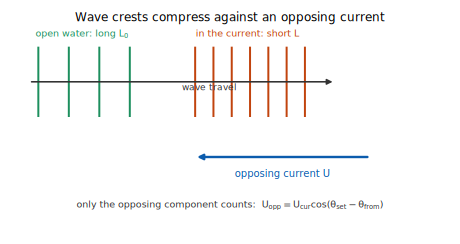
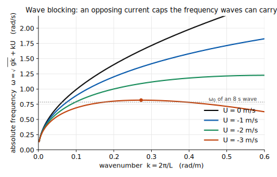
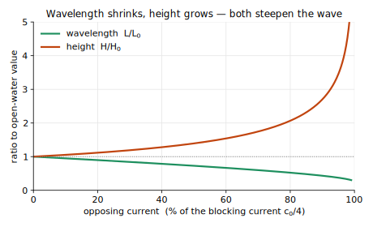
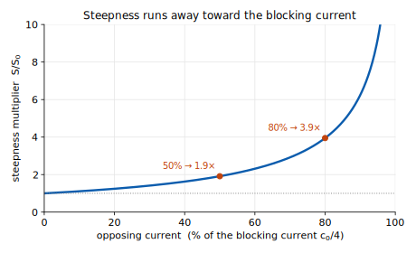
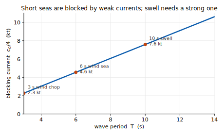
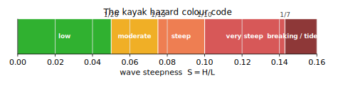
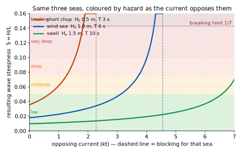

# Wind, waves and current — the physics behind the hazard map

*Companion notes for the HRDPS wind map with San Juan tidal‑current overlay*
(`hrdps_map.html`, build 2026‑07‑01a → <https://dsleaf1.github.io/hrdps-wind-map/>)

This document explains, with equations and sources, the wave‑steepness physics the
app uses to flag **wind‑against‑current** danger, and then documents exactly which
NOAA and ECCC datasets feed the wind/current/wave picture — including how the map
found the station coordinates on its own.

---

## Part I — The physics

### 1. Why steepness, not height

What capsizes a kayak is not a wave's height but its **steepness** — the ratio of
height to wavelength,

$$ S = \frac{H}{L}. $$

A 1‑metre swell 100 m long ($S = 1/100$) is a gentle roll; a 1‑metre wave 7 m long
($S = 1/7$) is a breaking wall carrying the same height. Waves become unstable and
break when the steepness reaches the **limiting steepness** first found by Michell
(1893) and Stokes for the highest progressive gravity wave:

$$ S_{\max} = \frac{H}{L} \approx \frac{1}{7} = 0.143, $$

at which the crest sharpens to an included angle of 120° and spills. In a real,
irregular sea a *significant* steepness of about **1/10** already means a large
fraction of the individual waves are breaking — which is why the colour code below
treats 1/10 as "very steep" and 1/7 as the outright breaking limit.

The reason opposing current is dangerous is that it drives $S$ upward on **both**
counts at once: it shortens $L$ *and* raises $H$.



### 2. Waves on a current: the dispersion relation

Deep‑water gravity waves obey the intrinsic (relative‑to‑the‑water) dispersion
relation

$$ \sigma^2 = gk, \qquad k = \frac{2\pi}{L}, $$

where $\sigma$ is the angular frequency *seen by an observer drifting with the
water* and $k$ the wavenumber. An observer fixed to the seabed instead sees the
**absolute** frequency Doppler‑shifted by the current $U$ (the component of the
current along the wave's direction of travel):

$$ \boxed{\;\omega = \sigma + kU = \sqrt{gk} + kU\;} \tag{1} $$

For a **steady** current the absolute frequency $\omega$ is conserved as the wave
train propagates from open water into the current (Longuet‑Higgins & Stewart 1961;
Phillips 1977). This single conservation law is what forces the wavelength to
change.

Equation (1) also contains the whole story of **wave blocking**. Plotting $\omega(k)$
for an opposing current ($U<0$) shows that the curve stops rising monotonically and
develops a maximum: there is a ceiling on the frequency the current can carry.



### 3. Wavelength shortening and height growth

Let subscript $0$ denote the open‑water (still‑water) values, and define the
non‑dimensional current and a convenient variable $x$:

$$ \alpha = \frac{U}{c_0}, \qquad c_0 = \frac{\sigma_0}{k_0} = \sqrt{\frac{g}{k_0}} = \frac{gT}{2\pi}, \qquad x = \sqrt{\frac{k}{k_0}}. $$

Here $c_0 \approx 1.56\,T$ (m/s) is the wave's deep‑water phase speed. Conserving
$\omega$ between still water and the current, $\sqrt{gk}+kU=\sqrt{gk_0}$, and
dividing through by $\sqrt{gk_0}$ gives a tidy quadratic:

$$ \boxed{\;\alpha x^2 + x - 1 = 0\;}\qquad\Longrightarrow\qquad x = \frac{-1+\sqrt{1+4\alpha}}{2\alpha}. \tag{2} $$

Because $L/L_0 = k_0/k = 1/x^2$, an opposing current ($\alpha<0$, so $x>1$)
**shortens the wavelength**.

The height follows from conservation of **wave‑action flux** (Bretherton & Garrett
1968; Phillips 1977). For steady conditions,

$$ \left(c_g + U\right)\frac{E}{\sigma} = \text{const}, \qquad E = \tfrac{1}{8}\rho g H^2, \qquad c_g = \tfrac12 c \ \text{(deep water)}. \tag{3} $$

Substituting $\sigma = x\,\sigma_0$ and $c_g + U = c_0\,(2-x)/(2x^2)$ into (3) yields

$$ \frac{E}{E_0} = \frac{x^3}{2-x}, \qquad\Longrightarrow\qquad \boxed{\;\frac{H}{H_0} = \frac{x^{3/2}}{\sqrt{2-x}}\;}. \tag{4} $$

As the current opposes the waves, the wavelength contracts toward $L_0/4$ and the
height grows without bound in linear theory.



### 4. The steepness‑amplification law

Combining the wavelength change ($L_0/L = x^2$) with the height change (4):

$$ \boxed{\;\frac{S}{S_0} = \frac{H/H_0}{L/L_0} = \frac{x^{3/2}}{\sqrt{2-x}}\cdot x^{2} = \frac{x^{7/2}}{\sqrt{2-x}}\;} \tag{5} $$

This is the exact function the app evaluates (`hazBand()` in `hrdps_map.html`).
Steepness climbs faster than height because the wavelength is shrinking at the same
time. The practical message is the **cliff**: near the blocking current a small
increase in current tips the sea over the edge.



| opposing current (of blocking) | steepness multiplier $S/S_0$ |
|---:|---:|
| 20 % | ≈ 1.25× |
| 50 % | ≈ 1.9× |
| 80 % | ≈ 4.0× |
| 95 % | ≈ 9× |
| 100 % | → ∞ (breaks) |

### 5. Wave blocking at a quarter of the wave speed

Equation (2) has a real solution only while $1+4\alpha \ge 0$, i.e.

$$ \boxed{\;U_{\text{stop}} = \frac{c_0}{4} = \frac{gT}{8\pi} \approx 0.76\,T \ \text{(kt)}\;} \tag{6} $$

At exactly this opposing current $x=2$ (so $k=4k_0$, $L=L_0/4$) and the ground‑frame
group velocity $c_g+U=0$: the wave energy can no longer advance, so it accumulates
and breaks in place. **This is the mechanism of a tide race or overfalls**
(Peregrine 1976; Chawla & Kirby 2002).

The blocking current scales with period, which produces the single most important
piece of local knowledge for a paddler:



* A short **3‑second wind chop** is blocked by only ≈ 2.3 kt of opposing current.
* A **10‑second swell** needs ≈ 6 kt before it blocks.

So the everyday hazard is local wind‑chop meeting an ebb; long swell against current
produces the dramatic *standing* waves, but only where the flow really rips
(Deception Pass, Cattle Point on a big ebb).

### 6. Only the opposing component counts

The current speed that matters in (1)–(6) is the component of the tidal set along
the wave's line of travel. With the wave *coming from* bearing $\theta_{\text{from}}$
and the current *setting toward* $\theta_{\text{set}}$,

$$ U_{\text{opp}} = U_{\text{cur}}\,\cos\!\left(\theta_{\text{set}} - \theta_{\text{from}}\right). \tag{7} $$

$U_{\text{opp}}>0$ opposes the waves (dangerous); $U_{\text{opp}}<0$ is a *following*
current that stretches the waves longer and lower — it actually flattens the sea. A
current quartering the waves projects onto their axis and is correspondingly less
severe.

### 7. From physics to a colour code

The app evaluates (2), (5) and (7) at every current station on the 48‑hour timeline,
using the live wave state ($H_s$, $T$, direction) and the tidal current at that
instant, then colours a ring by the resulting steepness $S$:



| Band | Steepness $S$ | Meaning for a kayak |
|---|---|---|
| 🟩 Low | $< 1/20$ | Gentle; no breaking |
| 🟨 Moderate | $1/20 – 1/13$ | Whitecaps building |
| 🟧 Steep | $1/13 – 1/10$ | Frequent breaking crests — hazardous |
| 🟥 Very steep | $1/10 – 1/7$ | Widespread breaking |
| 🟤 Breaking | $> 1/7$ or blocked | Tide race / overfalls — avoid |

Plotting the **resulting** steepness for three representative seas as the opposing
current grows shows the colour code in action, and why the short chop is the first
to go red:



**Consequence gate.** Linear theory (4)–(5) diverges at blocking, but a real wave
stops growing once it breaks and sheds energy, and a *tiny* sea — a 0.1 m ripple —
is low‑consequence even when technically "blocked". The app therefore caps the
height amplification at 2.5× and holds back the top colours unless the amplified
wave height is meaningful:

$$ \hat H = H_s\cdot\min\!\left(\frac{x^{3/2}}{\sqrt{2-x}},\,2.5\right),\qquad \hat H < 0.3\,\text{m}\Rightarrow \text{cap at Moderate},\quad \hat H < 0.5\,\text{m}\Rightarrow \text{cap at Steep}. $$

This stops small blocked ripples from false‑alarming red while still lighting up the
genuine wind‑against‑tide chop.

### 8. Assumptions and limitations

* **Deep water.** Equations (1)–(6) assume $L \ll$ depth. In the passes this is
  reasonable for the short seas that dominate; it ignores the extra shoaling
  steepening that also happens over a shallow sill (which would make real overfalls
  *worse*, not better — so the estimate is conservative there).
* **Steady, uniform current.** The theory is a snapshot; it does not resolve the
  horizontal shear and eddies of a real race.
* **Linear / monochromatic.** A single $H_s$, $T$ and direction stands in for the
  whole spectrum; the consequence gate is a pragmatic correction for the divergence.
* **Wave data resolution.** The global marine model barely resolves the inland
  passes (§13), so rings are muted deep in the archipelago and most trustworthy at
  exposed spots and when seas build.

### Sources (physics)

1. J. H. Michell (1893), *On the highest waves in water*, Phil. Mag. 36 — limiting
   steepness 1/7.
2. M. S. Longuet‑Higgins & R. W. Stewart (1960, 1961), *Changes in the form of short
   gravity waves on long waves and tidal currents*, J. Fluid Mech. 8 & 10 —
   radiation stress and wave–current interaction.
3. F. P. Bretherton & C. J. R. Garrett (1968), *Wavetrains in inhomogeneous moving
   media*, Proc. R. Soc. A 302 — conservation of wave action.
4. O. M. Phillips (1977), *The Dynamics of the Upper Ocean*, 2nd ed., Cambridge —
   wave action and the current‑modified energy balance.
5. D. H. Peregrine (1976), *Interaction of water waves and currents*, Adv. Appl.
   Mech. 16 — wave blocking, the $c_0/4$ stopping current.
6. I. G. Jonsson (1990), *Wave–current interactions*, in *The Sea*, vol. 9, Wiley.
7. A. Chawla & J. T. Kirby (2002), *Monochromatic and random wave breaking at
   blocking points*, J. Geophys. Res. 107(C7) — laboratory confirmation.
8. L. H. Holthuijsen (2007), *Waves in Oceanic and Coastal Waters*, Cambridge —
   textbook treatment of dispersion on currents and blocking.

---

## Part II — The data

The map layers three independent forecast sources on one 48‑hour timeline: **wind**
from Environment and Climate Change Canada (ECCC), **tidal currents** from the U.S.
NOAA, and **waves** from Open‑Meteo's marine model.

### 9. Wind — ECCC HRDPS

**Primary layer (true 2.5 km).** ECCC's High Resolution Deterministic Prediction
System, *Continental* domain, distributed as GRIB2 on the MSC Datamart:

```
https://dd.weather.gc.ca/today/model_hrdps/continental/2.5km/{HH}/{hhh}/
    {YYYYMMDD}T{HH}Z_MSC_HRDPS_WIND_AGL-10m_RLatLon0.0225_PT{hhh}H.grib2
    …_WDIR_AGL-10m…                         (wind direction, degrees true)
```

* `WIND` = 10 m wind speed (m/s → ×3.6 km/h); `WDIR` = direction (° true).
* Native grid: a **rotated** latitude/longitude grid at 0.0225° ≈ 2.5 km
  (`RLatLon0.0225`). Four runs per day.

A small pipeline (`hrdps-ingest`, GitHub Actions, 4×/day) decodes the GRIB2 with
`cfgrib`/ecCodes, regrids to each map region with a `scipy` k‑d‑tree
nearest‑neighbour, byte‑packs speed and direction, gzips, and uploads to Cloudflare
R2. The browser reads a `manifest.json` plus one `{region}.bin` per region and holds
all 48 hours in memory (instant zoom and scrub).

**Fallback layer (~3.7 km).** If R2 is unreachable the app fetches the same field
live from ECCC's GeoMet WCS service as GeoTIFF and decodes it in‑browser with
`geotiff.js`:

```
https://geo.weather.gc.ca/geomet?SERVICE=WCS&VERSION=2.0.1&REQUEST=GetCoverage
    &COVERAGEID=HRDPS.CONTINENTAL_WSPD   (and …_WD)
    &FORMAT=image/tiff&SUBSETTINGCRS=EPSG:4326&SUBSET=x(…)&SUBSET=y(…)
    &TIME={iso}&DIM_REFERENCE_TIME={run}
```

**Inshore option (1 km).** The experimental HRDPS *West* 1 km nest is also wired in
(GRIB2 only, on the alpha server, runs 00/12 Z):

```
https://dd.alpha.weather.gc.ca/model_hrdps/west/1km/grib2/{run}/{fff}/
    CMC_hrdps_west_WIND_TGL_10_rotated_latlon0.009x0.009_{date}T{run}Z_P{fff}-00.grib2
```

Note that the HRDPS grid's own latitude/longitude are read straight from the GRIB2
message metadata — the grid is **self‑describing**, so no coordinates had to be
supplied by hand for the wind field.

### 10. Currents — NOAA CO‑OPS tidal‑current predictions

Predicted currents come from NOAA's Center for Operational Oceanographic Products and
Services (CO‑OPS) API:

```
https://api.tidesandcurrents.noaa.gov/api/prod/datagetter?product=currents_predictions
    &station={ID}&begin_date={YYYYMMDD}&range=96&interval=MAX_SLACK
    &units=english&time_zone=gmt&format=json
```

`MAX_SLACK` returns the sequence of slack‑water and peak flood/ebb events. Each
record carries everything the overlay needs:

| field | meaning | used for |
|---|---|---|
| `Time` | UTC time of the event | timeline placement |
| `Type` | `slack` / `flood` / `ebb` | sign of the flow |
| `Velocity_Major` | signed speed (kt): **+ flood, − ebb** | current strength |
| `meanFloodDir` | mean flood set (° true) | arrow + $\theta_{\text{set}}$ |
| `meanEbbDir` | mean ebb set (° true) | arrow + $\theta_{\text{set}}$ |

Real sample, San Juan Channel (`PUG1703`), 1 Jul 2026:

```
02:15  slack   +0.01 kt   flood 347°  ebb 168°
05:39  ebb     −3.11 kt   flood 347°  ebb 168°
10:25  slack    0.00 kt
15:35  ebb     −4.10 kt
```

Between events the app reconstructs a continuous speed with a sinusoidal fit (slack →
peak → slack), and it takes the flood/ebb **directions straight from NOAA** rather
than assuming ebb = flood + 180° (real passes are often 15–30° off that).

### 11. Waves — Open‑Meteo Marine

Wave state at each current station comes from Open‑Meteo's marine model, fetched in a
single multi‑point call (comma‑separated coordinate lists):

```
https://marine-api.open-meteo.com/v1/marine?latitude={lat1,lat2,…}&longitude={lon1,…}
    &hourly=wave_height,wave_period,wave_direction&forecast_days=4&timezone=GMT
```

* `wave_height` = $H_s$ (m), `wave_period` = $T$ (s), `wave_direction` = mean
  direction *from* which the waves come (° true).
* Returned hourly and matched to the wind timeline; sampled **at the NOAA station
  coordinates**, so the wave, current and wind used in (7) all refer to the same
  point.

### 12. How the station coordinates were found — without your input

You asked specifically about this. Two independent mechanisms mean no coordinates had
to be typed in:

**(a) The HRDPS grid is self‑describing.** Every GRIB2 message contains its own grid
definition (the rotated‑pole parameters and spacing), so ecCodes/`cfgrib` returns the
full latitude/longitude arrays for the wind field automatically. The only
human‑chosen numbers on the wind side are the six regional viewing rectangles.

**(b) NOAA publishes a machine‑readable station directory.** The map discovered the
current stations from NOAA's metadata API, which lists *every* current‑prediction
station with its coordinates:

```
https://api.tidesandcurrents.noaa.gov/mdapi/prod/webapi/stations.json?type=currentpredictions
→ 4 430 stations, each  { id, name, lat, lng }
```

Filtering that list to the San Juan / Gulf Islands bounding box
(48.3–48.75° N, 122.5–123.25° W) returns **156 candidate stations**, from which 14
key passes were curated (Rosario, San Juan Channel, Cattle Point, Deception Pass,
etc.). The `lat`/`lng` in that directory are what position the arrows and rings on
the map, and the same coordinates are handed to Open‑Meteo for the wave sample. So
the whole San Juan overlay is bootstrapped from one public station list plus a
bounding box — no manual coordinate entry.

### 13. The 14 curated San Juan stations

| NOAA ID | Pass | Lat | Lon |
|---|---|---:|---:|
| PUG1702 | Rosario Strait | 48.458 | −122.750 |
| PUG1703 | San Juan Channel (S entrance) | 48.461 | −122.952 |
| PCT1416 | Cattle Point (2.8 mi SSW) | 48.400 | −123.000 |
| PUG1629 | Deception Pass (Yokeko Pt) | 48.413 | −122.613 |
| PUG1734 | Guemes Channel (W entrance) | 48.521 | −122.652 |
| PUG1733 | Thatcher Pass | 48.527 | −122.804 |
| PUG1705 | Obstruction Pass | 48.603 | −122.813 |
| PUG1704 | Peavine Pass (W entrance) | 48.587 | −122.819 |
| PUG1719 | Spieden Channel | 48.628 | −123.112 |
| PUG1715 | President Channel | 48.673 | −123.006 |
| PUG1739 | Bellingham Channel (S) | 48.540 | −122.683 |
| PUG1721 | Wasp Passage narrows | 48.593 | −122.990 |
| PUG1723 | Upright Channel narrows | 48.554 | −122.923 |
| PUG1722 | Harney Channel | 48.590 | −122.922 |

### 14. Putting it on one clock

The R2 wind manifest defines the hourly UTC timeline. NOAA current events are placed
on it by their UTC timestamps and interpolated; Open‑Meteo waves are matched to the
nearest hour. Scrubbing or playing the 48‑hour slider therefore advances wind,
current and the wave‑against‑current hazard ring together — which is the whole point:
you can see the ebb turn against the afternoon sea‑breeze chop and watch a pass go
amber → red in step.

### Sources (data)

* ECCC / MSC — HRDPS product page and Datamart:
  <https://eccc-msc.github.io/open-data/msc-data/nwp_hrdps/readme_hrdps_en/> ·
  <https://dd.weather.gc.ca/>
* ECCC GeoMet (OGC WMS/WCS): <https://eccc-msc.github.io/open-data/msc-geomet/readme_en/>
* NOAA CO‑OPS API (data + metadata): <https://api.tidesandcurrents.noaa.gov/api/prod/> ·
  <https://api.tidesandcurrents.noaa.gov/mdapi/prod/>
* Open‑Meteo Marine Weather API: <https://open-meteo.com/en/docs/marine-weather-api>

---

*Figures generated from the same equations the app evaluates
(`figs/fig1…7_*.svg`). Symbols: $H$ height, $L$ wavelength, $k=2\pi/L$, $T$ period,
$S=H/L$ steepness, $\sigma$ intrinsic frequency, $\omega$ absolute frequency, $U$
opposing current component, $c_0=gT/2\pi$ deep‑water phase speed,
$\alpha=U/c_0$, $x=\sqrt{k/k_0}$.*
